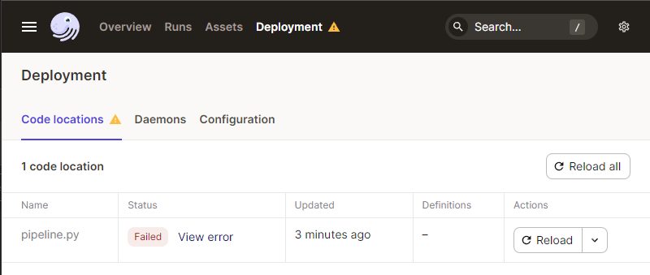
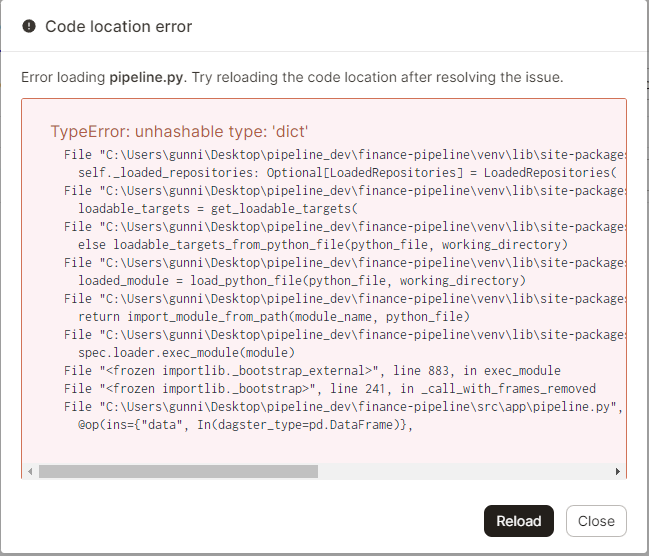
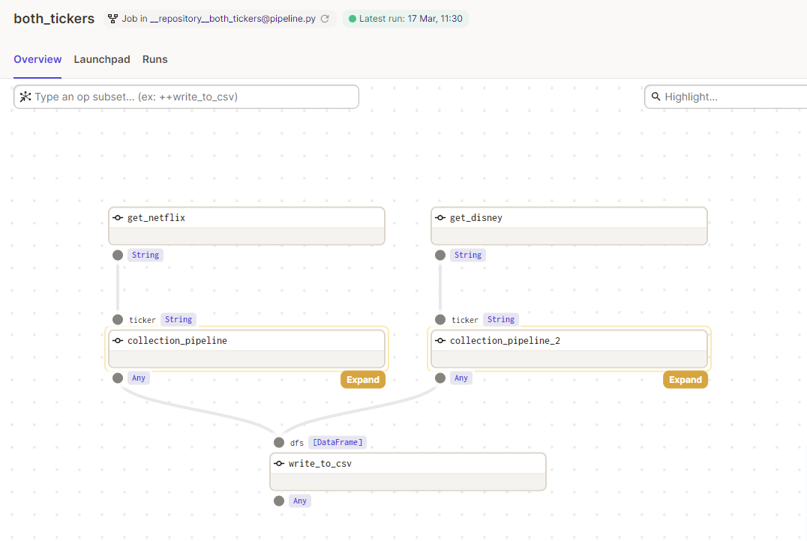
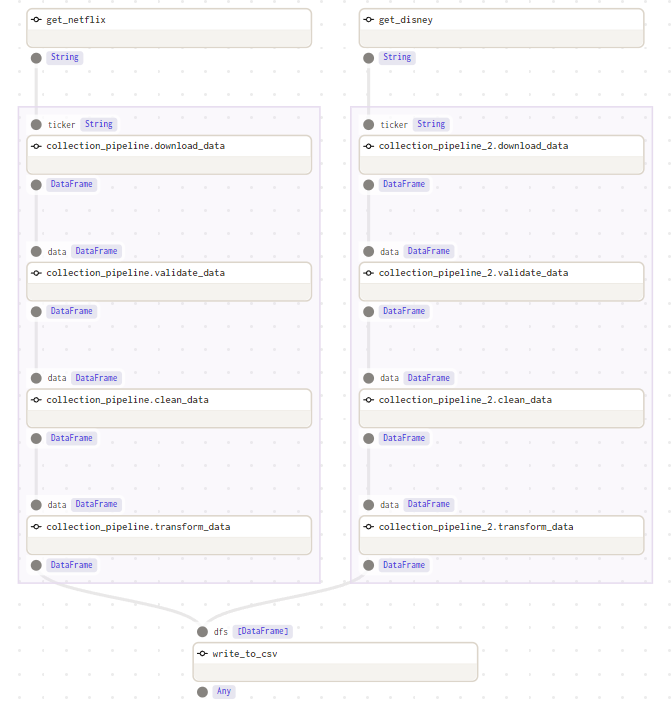
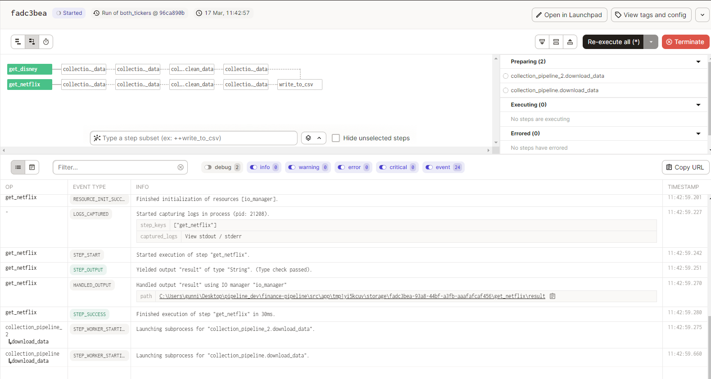
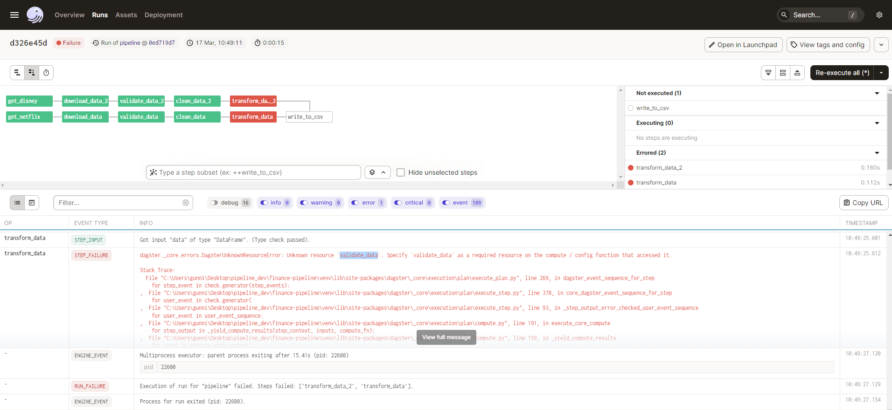
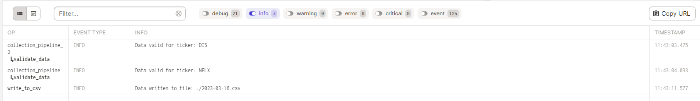

# Data Pipelines in Python

Data pipelines are an essential tool for managing and processing data in modern software systems. A data pipeline is a set of interconnected components that process data as it flows through the system. These components can include data sources, write down functions, transformation functions, and other data processing operations, such as validation and cleaning. Pipelines are a way to automate the process of collecting, transforming, and analysing data. They are a series of steps that take raw data, clean it, process it, and store it in a way that can be easily analysed or used in other applications. Pipelines are particularly useful when dealing with large amounts of data or when working with data that needs to be constantly updated.

They offer an improvement in behaviour over legacy ETL methods such as cron scheduling in testability, scalability, modularisation and ease of development and debugging in real time.

Pipelines help in automating the data processing, making it easier and quicker to collect, store, and analyse data. By breaking down data processing into smaller, more manageable tasks, pipelines make it easier to maintain and troubleshoot the system.

In this blog we will look at building a simple data pipeline using `dagster` and `yfinance` to:

- collect some simple market data
- validate that the expected data is present
- clean and enrich it
- saving the resultant data to disk
- show the data (external to the pipeline functionality)

Installation of libraries used in our `venv`:
```
pip install pandas yfinance dagster dagit matplotlib
```

## Building a Simple Pipeline

Before beginning to code our pipeline there are `definitions` available for input and outputs of function in Dagster, that allow high level type validation as the pipeline runs.

We can specify input and output definitions for any `op` (explained in the next section) using the `In` and `Out` classes from the `dagster` library. This helps to ensure that the inputs and outputs of the `op` are correctly typed and validated by the Dagster framework at runtime.

### Data Sourcing

The first step in building our data pipeline is to define a data source that downloads historical data for a specific ticker using yfinance. We will use the `yfinance.download()` function to pull historical data in 1 minute increments for that ticker.

Our first Dagster component is an `op`. They are reusable components that can be combined together to create more complex pipelines, they take one or more inputs, do a task and produce one or more outputs. 

An `op` function takes two arguments: context and inputs. The context argument provides access to information about the pipeline and the execution environment, such as loggers, configuration data, and metadata about the pipeline. The `ins` argument is a dictionary that contains the inputs to the op.

The output of an op is defined using the `Out` class from the Dagster library. An output definition specifies the name and type of the output produced by the `op`.

Here is our simple data sourcing function:

```
from datetime import datetime, timedelta
from dagster import op, In, Out, graph
from typing import List
import yfinance as yf
import pandas as pd


@op(ins={"ticker": In(dagster_type=str)},
    out=Out(pd.DataFrame))
def download_data(context, ticker: str) -> pd.DataFrame:
    # Calculate start and end dates for the download
    end_date = datetime.now().date()
    start_date = end_date - timedelta(days=1)

    # Download the data for Netflix ticker
    data = yf.download(ticker, start=start_date, end=end_date, interval="1m")

    # Filter to yesterday's data only
    yesterday = (datetime.now() - timedelta(days=1)).date()
    data = data.loc[data.index.date == yesterday]

    # Add column for ticker symbol
    data['Ticker'] = ticker

    return data
```

This will allow us to collect our data from `yfinance` for as many tickers as we want in a reusable fashion.

All inputs for `op` functions need to be part of the execution context or the result of another `op`. In a deployed setting we would set up an `op` that would define all the tickers we were interested in analysing, but for the purposes of this example pipeline we will only look at Disney and Netflix and manually define their ticker symbols.

```
@op(out=Out(str))
def get_netflix() -> str:
    return "NFLX"

@op(out=Out(str))
def get_disney() -> str:
    return "DIS"
```

### Validating the Data

Obviously data validation is a huge aspect of data engineering but beyond the scope of this blog, as such our data validation step is very lightweight and a placeholder for more robust testing in a production environment. 

Here we will just test that the returned data from our first step is not an empty DataFrame.

```
@op(ins={"data": In(dagster_type=pd.DataFrame)},
    out=Out(pd.DataFrame))
def validate_data(context, data: pd.DataFrame) -> pd.DataFrame:
    if data.empty:
        context.log.error(f"Data invalid for ticker: {data.iloc[0]['Ticker']}")
        return data
    else:
        context.log.info(f"Data valid for ticker: {data.iloc[0]['Ticker']}")
        return data
```

This op takes a single input argument, `data`, which should be the DataFrame returned by the `download_data` op. Note that while we log an error the execution will still return the empty dataframe.

### Cleaning and Enriching the Dataset

We also want to provide some simple cleaning functionality, for example we have no need of the "Adj Close" column returned to us by `yfinance`. This can be removed as a cleaning operation.

```
@op(ins={"data": In(dagster_type=pd.DataFrame)},
    out=Out(pd.DataFrame))
def clean_data(context, data: pd.DataFrame) -> pd.DataFrame:
    # Remove Adj Close columns from Data
    data.drop("Adj Close", axis=1, inplace=True)

    # Return the updated DataFrame
    return data
```

Now that we have some data that is ready to work with, we can add our own metrics and enrich the DataFrame before saving it down.

Currently our data looks like this:

|Datetime |Open	|High	|Low	|Close	|Volume| Ticker|	
|--|--|--|--|--|--|--|				
|2023-03-14 09:30:00-04:00|	295.970001|	297.450012|	295.970001|	296.579987|	110684|NFLX|
|2023-03-14 09:31:00-04:00|	296.579987|	296.789886|	294.809998|	295.149994|	22967|NFLX|
|2023-03-14 09:32:00-04:00|	295.170013|	295.549988|	294.679993|	295.190002|	22126|NFLX|
|...|	...|	...|	...|	...|	...|...|

Our next step is transforming the data with some enrichments. We will add a cumulative value of all the trades for a ticker along with a 15 minute rolling VWAP, and add them to the DataFrame.

```
@op(ins={"data": In(dagster_type=pd.DataFrame)},
    out=Out(pd.DataFrame))
def transform_data(context, data: pd.DataFrame) -> pd.DataFrame:
    # Columns needed to determine rolling VWAP
    data['Typical Price'] = (data['High'] + data['Low'] + data['Close']) / 3
    data['Cumulative TPV'] = data['Typical Price'] * data['Volume']
    data['Cumulative Volume'] = data['Volume'].cumsum()
    data['Rolling TPV'] = data['Cumulative TPV'].rolling(
        '15min', min_periods=1).sum()
    data['Rolling Volume'] = data['Volume'].rolling(
        '15min', min_periods=1).sum()

    # Add the rolling VWAP to the DataFrame
    data['VWAP'] = data['Rolling TPV'] / data['Rolling Volume']

    # Remove unneeded intermediete columns
    data.drop(['Typical Price',
               'Rolling Volume',
               'Cumulative TPV',
               'Cumulative Volume',
               'Rolling TPV'], axis=1, inplace=True)

    # Calculate the cumulative dollar value of all trades
    dollar_value = (data['Close'] * data['Volume']).cumsum()

    # Add the dollar value column to the data DataFrame
    data['DollarValue'] = dollar_value

    # Return the updated DataFrame
    return data
```
After transformation our data now looks like this:

|Datetime	|Open	|High	|Low	|Close	|Volume	|Ticker |VWAP	|DollarValue|
|--|--|--|--|--|--|--|--|--|								
|2023-03-15 09:30:00-04:00	|292.510010	|293.600006	|292.279999	|292.950012	|132267	|NFLX|292.943339	|3.874762e+07|
|2023-03-15 09:31:00-04:00	|293.070007	|294.093689	|293.031189	|293.390015	|22140	|NFLX|293.023869	|4.524327e+07|
|2023-03-15 09:32:00-04:00	|293.220001	|293.839996	|293.079987	|293.429993	|11611	|NFLX|293.053671	|4.865029e+07|
|...|	...|	...|	...|	...|	...|    ...|    ...|...|
### Write Down

For the purposes of this blog we will just be saving our data locally to a csv, however you can include code here to store the data in any format locally or remotely in the cloud based on your needs, just as you would without the `op` decorated function. In this `op` we use the `context` argument and access some of the pipeline functionality for logging, here just to write a job success message.

We will store our data in a csv per day with a naming convention to match that logic.

We want to be able to write multiple tickers to the same day of data, so code the write function to expect more than one DataFrame, in order to paralellise our data collection pipelines and perform one write operation upon completion.

```
@op(ins={"dfs": In(dagster_type=List[pd.DataFrame])})
def write_to_csv(context, dfs):
    # Combine different datasets
    data = pd.concat(dfs, ignore_index=False).sort_values("Datetime")

    # Get the daily date of the data
    filepath = f"./{str(data.index[0].date())}.csv"

    # Write the transformed data to a CSV file
    data.to_csv(filepath)

    # Log a message to confirm that the data has been written to the file
    context.log.info(f"Data written to file: {filepath}")
```

## Building a Pipeline

We now have all of the required component functions to build a pipeline that will capture, clean, validate, transform and load some market data for us.

Time to put them together in a pipeline.

### Graphs

All of our `op` functions are in a file called `ops.py`. We can import them into a new file where we define our pipeline execution steps, this will be done in a Dagster `graph`. A `graph` is a set of interconnected ops or sub-graphs. While individual ops typically perform simple tasks, ops can be assembled into a graph to accomplish complex tasks.

We will have one `graph` for data collection that executes for one ticker, and another `graph` that will contain more than one version of our collection `graph` to execute and then pass all of the outputs into our write down function.

Our `graph` definitions will look like this:
```
@graph
def collection_pipeline(ticker: str):
    # Get data for ticker
    data = download_data(ticker)

    # Ensure data is valid and clean
    data = clean_data(validate_data(data))

    # Enrich data
    data = transform_data(data)

    return data


@graph
def running_pipeline():
    data_nflx = collection_pipeline(get_netflix())
    data_dis = collection_pipeline(get_disney())

    # Save combined datasets to one location on disk
    write_to_csv([data_nflx, data_dis])
```

### Jobs

Jobs are the main unit of execution and monitoring in Dagster. The core of a `job` is a `graph` of `op`s connected via data dependencies.

Finally, we will export our `running_pipeline` to a Dagster `job`, named `pipeline_job`. This will allow us to name the executable job for the UI and add a brief description for readability to anyone interacting with the UI.

```
pipeline_job = running_pipeline.to_job(
    "both_tickers", description="Combined job for Netflix and Disney market data collection and processing.")
```

Only with jobs can we set up scheduling, sensors (triggers to execute other pipeline components when conditions are met) or provide external components that can differ by environment.

## Running Dagit UI

On your CLI run the following command to spin up the Dagster daemon processes:
```
$ dagster dev -f pipeline.py -p 8080
```

It should show a few `INFO` context messages before completing the start up and show this:
```
2023-03-17 16:48:12 +0000 - dagit - INFO - Serving dagit on http://127.0.0.1:8080 in process 19696
```

We can now access the UI on our browser.

It provides information on our deployed pipeline code and will flag errors at the highest level like below:



We can click into the details of the error, giving us insight of the problem to be fixed. 



Once fixed, we can use the reload function of the Dagit UI to quickly reload the codebase, ensure the fix worked and progress with our pipeline deployment.

Clicking through to the jobs allows us to see the architecture of our pipeline, with the nested graphs collapsed by default giving a high level view of what order of execution will run when we launch the job.



We can expand these out to see the individual ops that makle up the graphs for the job, incluiding the datatypes expected and produced by each op.



Moving to the launchpad in the UI, we can launch a run of our pipeline job and have real time execution status visualised in the browser, along with a constant stream of log information underneath.



If the pipeline throws an error mid execution it will show you exactly which step it occurred on, and continue to execute non-dependant jobs further downstream or in parallel executions.



If the error is temporary, such as a remote API refusing connection for too many requests, you can re-execute the pipeline from just that step. Retaining all the cached data from the other ops already completed without the need to start the pipeline execution from the start.

With the log info writer that was added to some of our ops, we can see the output in the UI as the ops complete.



After the run completes for each sub-graph, both outputs are sent to the last op of the parent graph and writes the data down to csv.

Our stored csv now contains all the data from our pipeline run, and is available for whatever use case we desire.:
```
Datetime,Open,High,Low,Close,Volume,Ticker,VWAP,DollarValue
2023-03-16 09:30:00-04:00,304.75,305.0,303.3601989746094,303.5299987792969,154501,NFLX,303.96339925130206,46895688.34140015
2023-03-16 09:30:00-04:00,92.66999816894531,92.80000305175781,92.44499969482422,92.56999969482422,147401,DIS,92.60500081380208,13644910.525016785
2023-03-16 09:31:00-04:00,303.45001220703125,304.2698974609375,302.54998779296875,302.6023864746094,15654,NFLX,303.8877174435357,51632626.09927368
2023-03-16 09:31:00-04:00,92.52999877929688,92.5999984741211,92.19999694824219,92.19999694824219,19711,DIS,92.57295710757401,15462264.664863586
...

```

Here we can run a script that will show the data generated by the pipeline:
```
import pandas as pd
import matplotlib.pyplot as plt

# Load your data into a pandas dataframe
df = pd.read_csv('./2023-03-16.csv')
df = df[df['Ticker'] == 'NFLX']
# Convert the 'date' column to datetime format
df['Datetime'] = pd.to_datetime(df['Datetime'])

# Create a new column to store the difference between VWAP and Close
df['diff'] = df['VWAP'] - df['Close']

# Create a new column to store whether the difference is positive or negative
df['sign'] = df['diff'].apply(lambda x: 'positive' if x >= 0 else 'negative')

# Plot the VWAP and Close lines
fig, ax = plt.subplots()
ax.plot(df['Datetime'], df['VWAP'], label='VWAP')
ax.plot(df['Datetime'], df['Close'], label='Close')

# Set the x-axis label and legend
ax.set_xlabel('Datetime')
ax.legend()

# Show the plot
plt.show()
```


For more information about deploying a Dagster pipeline in a production environment, check out the docs here: [Deploying Dagster](https://docs.dagster.io/deployment/open-source#deploying-dagster)
